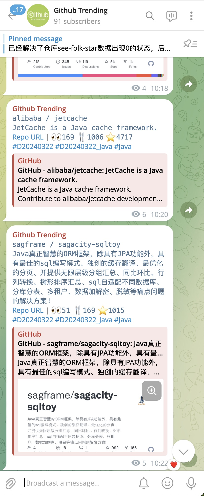
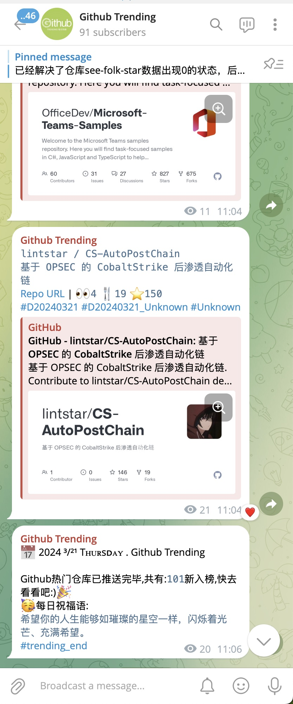

# GitHub Trending

使用 [GitHub Actions](https://docs.github.com/cn/actions) 跟踪 [GitHub 趋势项目](https://github.com/trending)。

具体教程可以 [参考这里](https://github.com/aneasystone/weekly-practice/blob/main/notes/week018-tracking-github-trending/README.md)。

项目灵感来自 [bonfy/github-trending](https://github.com/bonfy/github-trending)。

关注 Github Trending 频道 谢谢喵！
[Github Trending](https://t.me/ghtrendings)

## 效果图



## 功能
- 每日定时抓取多语言 GitHub Trending 榜单（All/Java/Python/Go/Javascript/Typescript/C/C++/C#/Rust/Html）
- 新上榜仓库实时推送到 Telegram 频道，附带 watch/fork/star 统计数据
- SQLite 数据库存档所有上榜记录（上榜次数、仓库统计、失效标记）
- 推送去重判断，防止 Telegram 消息重复推送
- 每日推送结束消息 + 随机祝福语
- 周末（周六、周日）自动汇总本周上榜仓库，生成 telegra.ph 媒体周报并推送频道；文章地址存入数据库，并附在当日的推送结束问候语中
- 每天更新一次固定的 telegra.ph 数据统计页（语言分布 + 各语言 Star/上榜次数 Top 榜，受 telegra.ph 64KB 限制自动缩减数量），页面原地刷新并展示数据更新日期；统计页地址自动回写到本 README（见下方「📊 固定统计页」区块）

## 环境变量

通过 GitHub Secrets（或本地环境变量）配置：

| 变量 | 说明 | 必填 |
| --- | --- | --- |
| `TG_CHAT_ID` | Telegram 频道/聊天 ID | 是 |
| `TG_BOT_TOKEN` | Telegram Bot Token | 是 |
| `GH_TOKEN` | GitHub Token（提升 API 限额） | 否 |
| `TELEGRAPH_TOKEN` | telegra.ph Token（固定周报作者与统计页账号，强烈建议配置）；未配置时自动注册并保存到数据库 | 否 |

## 运行

**自动运行**：push 到 master 或每日 cron（`0 2 * * *`）触发 [.github/workflows/schedule.yml](.github/workflows/schedule.yml)。每天会自动更新 telegra.ph 固定统计页并把地址回写到本 README；周末会额外生成本周热榜周报，周报地址会附在当日的推送结束问候语中。

**本地运行**：

```bash
pip install -r requirements.txt
python main.py            # 抓取榜单并推送 Telegram 频道（周末自动附带周报与统计页更新）
python tgph_report.py     # 手动生成本周 telegra.ph 周报并强制刷新统计页
python patch_db.py        # 补录缺失的仓库统计数据
```

## 项目结构

```
├── main.py           # 主流程：抓取 -> 入库 -> 推送
├── tgph_report.py    # 每周 telegra.ph 周报 + 每日固定统计页(Top 榜)
├── telegrambot.py    # Telegram 消息推送 & MarkdownV2 转义
├── database.py       # SQLAlchemy 模型(gh_trending/every_day_bless/weekly_report)
├── bless.py          # 每日祝福语与日期格式化
├── patch_db.py       # 仓库统计数据补录
├── addstar.py        # 为归档 Markdown 追加 star 徽章
```

## 更新记录

1. 加入telegram 消息推送
2. 加入sqlite数据库支持
3. 加入上榜次数统计
4. 加入推送判断，防止telegram消息重复推送
5. 加入仓库统计数据
6. 加入仓库失效标记
7. 加入每日推送结束和随机祝福语
8. 加入每周热榜 telegra.ph 媒体周报，文章地址入库保存
9. 移除 TrendsHist.md 归档逻辑，历史数据统一由数据库与 archived/ 目录承载
10. 统计页升级为每日自动更新（各语言 Top 榜），地址回写 README.md；修复 Actions 中已废弃的 set-output 语法导致变更从未推送的问题
11. tgph_report.py 重命名 update_weekly_stats_page -> update_daily_stats_page（同日跳过、force 强刷）
