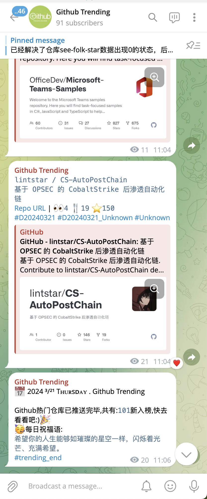

# GitHub Trending

使用 [GitHub Actions](https://docs.github.com/cn/actions) 跟踪 [GitHub 趋势项目](https://github.com/trending)。

具体教程可以 [参考这里](https://github.com/aneasystone/weekly-practice/blob/main/notes/week018-tracking-github-trending/README.md)。

项目灵感来自 [bonfy/github-trending](https://github.com/bonfy/github-trending)。

关注 Github Trending 频道 谢谢喵！
[Github Trending](https://t.me/ghtrendings)

## 效果图

更新:
1. 加入telegram 消息推送
2. 加入sqlite数据库支持
3. 加入上榜次数统计
4. 加入推送判断，防止telegram消息重复推送
5. 加入仓库统计数据
6. 加入仓库失效标记
7. 加入每日推送结束和随机祝福语

## 历史数据

[TrendsHist](TrendsHist.md)
